# Product Feature Development Workflow

## Overview
This diagram shows the complete workflow from product ideation through implementation, using the available agents and skills in the system.

```mermaid
graph TD
    Start([Product Feature Request]) --> IssueValidation

    %% Product Team Phase
    subgraph ProductPhase["🎯 Product Phase"]
        IssueValidation[/"<b>issue_validation</b><br/>Validate & enhance issue<br/>Capture requirements"/]
        ProductReview{Product Team<br/>Review}
        IssueIteration[/"Iterate on issue<br/>Add missing details<br/>Clarify requirements"/]

        IssueValidation --> ProductReview
        ProductReview -->|Needs refinement| IssueIteration
        IssueIteration --> IssueValidation
        ProductReview -->|Approved| ArchitecturePlanning
    end

    %% Architecture Phase
    subgraph ArchitecturePhase["🏗️ Architecture Phase"]
        ArchitecturePlanning[/"<b>architecture-planner</b><br/>Analyze specs<br/>Create technical architecture<br/>Define implementation strategy"/]
        TaskBreakdown[/"<b>task-breakdown-architect</b><br/>Break down into tasks<br/>Define dependencies<br/>Create task hierarchy"/]
        ComplexityAnalysis[/"<b>task-complexity-analyzer</b><br/>Analyze task complexity<br/>Break down complex tasks<br/>Ensure proper scoping"/]

        ArchitecturePlanning --> TaskBreakdown
        TaskBreakdown --> ComplexityAnalysis
        ComplexityAnalysis --> TaskReady{All tasks<br/>manageable?}
        TaskReady -->|No - complexity > 7| ComplexityAnalysis
        TaskReady -->|Yes| TaskSelection
    end

    %% Task Management
    subgraph TaskManagement["📋 Task Management"]
        TaskSelection{Select next task}
        LinearTracking[/"<b>task_management</b><br/>Linear integration<br/>Track progress"/]

        TaskSelection --> LinearTracking
        LinearTracking --> TaskPrep
    end

    %% Implementation Phase
    subgraph ImplementationPhase["⚙️ Implementation Phase"]
        TaskPrep[/"<b>task-prep-architect</b><br/>Gather context<br/>Create implementation plan"/]
        TaskExecute[/"<b>task-executor-tdd</b><br/>TDD implementation<br/>Write tests first<br/>Implement feature"/]
        TaskReview[/"<b>task-implementation-reviewer</b><br/>Review git diff<br/>Verify tests pass<br/>Check requirements"/]

        TaskPrep --> TaskExecute
        TaskExecute --> TaskReview
        TaskReview --> ImplementationCheck

        ImplementationCheck{Implementation<br/>Complete?}
        ImplementationCheck -->|Issues found| TaskPrep
        ImplementationCheck -->|Success| ExpertReview
    end

    %% Quality Assurance Phase
    subgraph QualityPhase["✅ Quality Assurance Phase"]
        ExpertReview[/"<b>typescript-expert-reviewer</b><br/>Expert-level TS review<br/>Type safety check<br/>Performance review<br/>Best practices"/]

        ExpertReview --> QualityCheck

        QualityCheck{Quality<br/>Approved?}
        QualityCheck -->|Needs fixes| TaskPrep
        QualityCheck -->|Approved| GitOperations
    end

    %% Git Operations
    subgraph GitPhase["🌿 Git Phase"]
        GitOperations[/"<b>Git Operations</b><br/>Create worktree (optional)<br/>Commit changes<br/>Create PR"/]
        PRReview{PR Review}

        GitOperations --> PRReview
        PRReview -->|Changes requested| TaskPrep
        PRReview -->|Approved & merged| MoreTasks
    end

    %% Continuation
    MoreTasks{More tasks<br/>in feature?}
    MoreTasks -->|Yes| TaskSelection
    MoreTasks -->|No| Complete

    Complete([✨ Feature Complete])

    %% Styling
    classDef productStyle fill:#e1f5ff,stroke:#0288d1,stroke-width:2px
    classDef archStyle fill:#fff3e0,stroke:#f57c00,stroke-width:2px
    classDef implStyle fill:#f3e5f5,stroke:#7b1fa2,stroke-width:2px
    classDef qualityStyle fill:#e8f5e9,stroke:#388e3c,stroke-width:2px
    classDef gitStyle fill:#fce4ec,stroke:#c2185b,stroke-width:2px
    classDef decisionStyle fill:#fff9c4,stroke:#f9a825,stroke-width:2px

    class IssueValidation,IssueIteration productStyle
    class ArchitecturePlanning,TaskBreakdown,ComplexityAnalysis,LinearTracking archStyle
    class TaskPrep,TaskExecute,TaskReview implStyle
    class ExpertReview qualityStyle
    class GitOperations gitStyle
    class ProductReview,TaskReady,TaskSelection,ImplementationCheck,QualityCheck,PRReview,MoreTasks decisionStyle
```



## Workflow Phases Explained

### 1. 🎯 Product Phase
**Goal:** Validate and refine the feature requirements

- **issue_validation agent**: Validates GitHub issues, enhances descriptions, ensures all questions are answered
- **Iteration**: Product team reviews and requests refinements until requirements are clear
- **Output**: Well-defined, validated GitHub issue with clear requirements

### 2. 🏗️ Architecture Phase
**Goal:** Design the technical solution and break it down into tasks

- **architecture-planner agent**: Analyzes specifications, creates technical architecture, defines implementation strategy
- **task-breakdown-architect agent**: Breaks down the architecture into structured development tasks with dependencies
- **task-complexity-analyzer agent**: Analyzes each task's complexity (1-10 scale), breaks down any task with complexity ≥7
- **Output**: Set of manageable, well-scoped tasks ready for implementation

### 3. 📋 Task Management
**Goal:** Track and coordinate task execution

- **task_management skill**: Linear integration for tracking progress, updating task status
- **Output**: Selected task ready for implementation

### 4. ⚙️ Implementation Phase (TDD)
**Goal:** Implement the feature following Test-Driven Development

1. **task-prep-architect**: Gathers context, explores codebase, creates implementation plan
2. **task-executor-tdd**: Writes tests first, implements feature, ensures tests pass
3. **task-implementation-reviewer**: Reviews git diff, verifies tests, checks requirements met

### 5. ✅ Quality Assurance Phase
**Goal:** Expert-level code review for production quality

- **typescript-expert-reviewer**: Matt Pocock-level TypeScript review (type safety, performance, patterns)
- **Output**: Production-ready code that meets quality standards

### 6. 🌿 Git Phase
**Goal:** Version control and code review

- **Git operations**: Optional worktree creation, commits with co-author attribution, PR creation
- **PR Review**: Team reviews the pull request
- **Output**: Merged code or feedback for improvements

## Key Workflow Features

### Iterative Loops
- **Product Loop**: Issue validation ↔ Product review until requirements are clear
- **Complexity Loop**: Task analysis ↔ Breakdown until all tasks are manageable
- **Implementation Loop**: Code ↔ Review ↔ Expert review until quality standards met
- **PR Loop**: Implementation ↔ PR review until approved

### Quality Gates
1. **Product Approval**: Requirements must be validated before architecture phase
2. **Complexity Check**: Tasks must be complexity ≤7 before implementation
3. **Implementation Review**: Code must pass basic review before expert review
4. **Expert Review**: Code must pass expert review before PR creation
5. **PR Approval**: Team must approve before merge

### Streamlined Process
- All features follow a consistent TDD workflow regardless of scope
- Clear quality gates ensure production-ready code at each stage

## Usage Example

```bash
# 1. Start with issue validation
/issue_validation

# 2. Once approved, plan architecture
# Use architecture-planner agent via Task tool

# 3. Break down into tasks
# Use task-breakdown-architect agent

# 4. For each task:
#    - Use task-prep-architect to prepare
#    - Use task-executor-tdd to implement
#    - Use task-implementation-reviewer to review
#    - Use typescript-expert-reviewer for final review

# 5. Create PR and merge when approved
```

## Benefits of This Workflow

1. **Quality First**: Multiple review stages ensure production-ready code
2. **Clear Handoffs**: Each phase has defined outputs and entry criteria
3. **Iterative Refinement**: Loops at each stage allow for continuous improvement
4. **TDD Enforced**: Test-driven development is built into the implementation phase
5. **Complexity Management**: Automatic detection and breakdown of overly complex tasks
6. **Traceability**: From issue → architecture → tasks → implementation → review → merge
